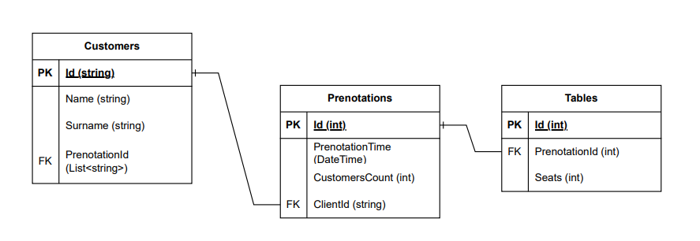

# RestaurantAPI User Guide

RestaurantAPI is a RESTful API developed as part of a school project to manage restaurant data. This guide helps users understand how to set up and interact with the API.

## Features

- **CRUD Operations**: Manage restaurant data, menus, orders, and reservations.
- **Secure Authentication**: Endpoints secured using JWT-based authentication.
- **Scalable & Modular**: Clean architecture following best practices.
- **Extensible**: Supports additional features like user management and order processing.

## Technologies Used

- **Backend**: C# with ASP.NET Core
- **Database**: PostgreSQL
- **Authentication**: JSON Web Tokens (JWT)
- **Development Tools**: Visual Studio, JetBrains Rider

## Getting Started

### Prerequisites

Before using RestaurantAPI, ensure you have the following installed:

- [PostgreSQL](https://www.postgresql.org/)
- [Visual Studio](https://visualstudio.microsoft.com/) or [JetBrains Rider](https://www.jetbrains.com/rider/)

### Installation

1. **Clone the repository:**
   ```bash
   git clone https://github.com/school-project-restaurant/Lume-Server.git
   cd Lume-Server
   ```
2. **Configure the database:**
   - Ensure PostgreSQL is running.
   - Update the `appsettings.json` file with your database connection details.
3. **Build and run the project:**
   ```bash
   dotnet build
   dotnet run
   ```
   The API should now be accessible at [http://localhost:5155](http://localhost:5155).

## API Usage

### Available Endpoints

Below is a summary of the core endpoints. For a full reference, see the [API Documentation](./API_DOCUMENTATION.md) (if available).

#### Restaurants
- **GET /restaurants** – Fetch all restaurants.
- **GET /restaurants/{id}** – Retrieve details of a specific restaurant.
- **POST /restaurants** – Add a new restaurant.
- **PUT /restaurants/{id}** – Update an existing restaurant.
- **DELETE /restaurants/{id}** – Remove a restaurant.

## Database Schema

The database structure is outlined in the diagram below:

<p>
   
</p>

## License

This project is licensed under the MIT License. See the [LICENSE](LICENSE) file for details.

